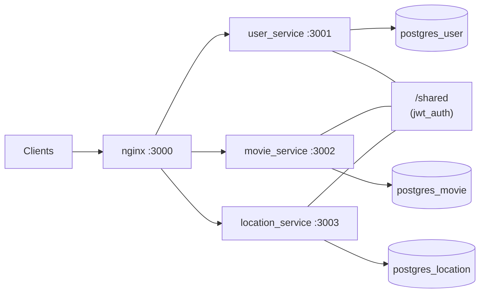

# Universal App

A Ruby on Rails backend organized as three independent HTTP services—**user**, **movie**, and **location**—plus a **`shared`** directory for code reused across those services. Each service has its own PostgreSQL database. An **nginx** reverse proxy (via Docker Compose) exposes a single entry point on the host and routes traffic to the correct service by URL path.

## Architecture



- **Databases**: One Postgres instance per domain (`user_db`, `movie_db`, `location_db`), each in its own container with a persistent volume.
- **Gateway**: `nginx` listens on port **3000** on the host (mapped to port 80 in the container) and forwards requests to the Rails apps by path prefix (see [Gateway routing](#gateway-routing)).

## Repository layout

| Path | Purpose |
|------|---------|
| `services/user-service/` | Authentication, users, profile (JWT issuance; S3 for profile images). |
| `services/movie-service/` | Movies, casts, movie details, movie images (pagination via Kaminari; S3 for assets). |
| `services/location-service/` | User location records (latitude/longitude, optional accuracy and capture time). |
| `shared/` | Cross-service Ruby code loaded by each app (see [Shared code](#shared-code)). |
| `nginx/` | Reverse proxy configuration for Compose. |
| `docker-compose.yml` | Orchestrates nginx, three Postgres instances, and the three Rails services. |

## Tech stack

- **Ruby** 3.3.x (see `.ruby-version` in each service)
- **Rails** ~> 8.0.4
- **PostgreSQL** 16 (Alpine images in Compose)
- **nginx** (Alpine) as API gateway
- **Docker** / Docker Compose for local full-stack runs

Notable gems (vary by service): `pg`, `jwt`, `bcrypt` (user service), `aws-sdk-s3`, `kaminari` (movie service).

## Shared code

The `shared/` directory holds reusable modules. Each service mounts `./shared` at **`/shared`** in Docker and loads all `*.rb` files under that path via `config/initializers/shared.rb`.

Current modules:

- **`shared/jwt_auth/jwt_authenticator.rb`** — HS256 JWT helpers: encode/decode **auth** and **refresh** tokens, expiry constants, and error types. Requires `JWT_AUTH_SECRET` and `JWT_REFRESH_SECRET` (refresh secret is used where refresh tokens are issued).
- **`shared/jwt_auth/authenticatable.rb`** — `JwtAuth::Authenticatable` concern: `before_action` to validate the `Authorization: Bearer <token>` header and expose `current_user_id` / `current_user_email` from the token payload.

The user service `config/application.rb` additionally requires `/shared/jwt_auth/authenticatable` at boot so the concern is available application-wide. **JWT signing secrets must be consistent** across every service that validates the same tokens (typically `JWT_AUTH_SECRET` aligned on user, movie, and location services).

## Services overview

### User service (`user-service`)

- **Database**: `user_db` on host `postgres_user` (Compose network).
- **Default app port in Docker**: **3001** (see Dockerfile `CMD`).
- **Responsibilities**: Register, login, refresh tokens; get/update profile. Users store `name`, `email`, `password_digest`, optional `profile_image_key` (S3).
- **API** (under `/api/v1/`):
  - `POST /api/v1/auth/register`, `POST /api/v1/auth/login`, `POST /api/v1/auth/refresh`
  - `GET /api/v1/users/profile`, `POST /api/v1/users/profile` (update profile)
- **Health**: `GET /up` (Rails health check).

### Movie service (`movie-service`)

- **Database**: `movie_db` on `postgres_movie`.
- **Default app port in Docker**: **3002**.
- **Responsibilities**: CRUD-style REST resources for movies, related images, casts, and movie details; S3-backed keys for images where applicable.
- **API**: `resources` for `movies`, `movie_images`, `casts`, `movie_details` under `/api/v1/` (standard Rails REST routes).
- **Auth**: API controllers use `JwtAuth::Authenticatable`; clients must send a valid auth JWT from the user service.
- **Health**: `GET /up`.

### Location service (`location-service`)

- **Database**: `location_db` on `postgres_location`.
- **Default app port in Docker**: **3003**.
- **Responsibilities**: Persist locations per `user_id` with coordinates; supports `bulk_create` on the collection.
- **API**: `resources :locations` plus `POST /api/v1/locations/bulk_create`.
- **Auth**: Same JWT validation as the movie service.
- **Health**: `GET /up`.

## Gateway routing

With Docker Compose, **`http://localhost:3000`** hits nginx. The bundled `nginx/nginx.conf` forwards:

| Path prefix | Upstream |
|-------------|----------|
| `/api/v1/auth/` | `user_service:3001` |
| `/api/v1/users/` | `user_service:3001` |
| `/api/v1/movies/` | `movie_service:3002` |
| `/api/v1/locations/` | `location_service:3003` |

Other paths (including `/health` on the gateway) behave as defined in nginx—for example, `GET /health` returns plain `ok`. Unmatched routes return a JSON 404 from nginx.

**Note:** The movie app also exposes `/api/v1/movie_images`, `/api/v1/casts`, and `/api/v1/movie_details`. Those URL prefixes are **not** included in the sample nginx config. To use them through the same gateway, add matching `location` blocks (or call the movie service directly, e.g. by publishing its port in Compose).

## Prerequisites

- Docker and Docker Compose (recommended path to run databases + nginx + all three apps)
- Ruby 3.3+ and Bundler if you run Rails locally outside Docker (you must still satisfy `/shared` paths and database hosts expected by `config/database.yml`, or adjust configuration for your environment)

## Configuration

### Root `.env` (Compose)

Copy `.env.example` at the repository root to `.env` and set:

- `POSTGRES_PASSWORD` — password shared by the three Postgres containers (must match what each service uses to connect).

### Per-service `.env`

Each service has `.env.example` under `services/<name>/.env.example`. Copy to `.env` and set variables such as:

- **Common**: `POSTGRES_PASSWORD`, `RAILS_ENV`, `RAILS_MAX_THREADS`
- **JWT**: `JWT_AUTH_SECRET` (all validating services); `JWT_REFRESH_SECRET` (user service issues refresh tokens)
- **AWS** (user and movie services, where S3 is used): `AWS_REGION`, `AWS_ACCESS_KEY`, `AWS_SECRET_KEY`, `AWS_BUCKET`

Compose references `services/user-service/.env`, `services/movie-service/.env`, and `services/location-service/.env` via `env_file`.

## Running with Docker Compose

From the repository root (after creating `.env` files as above):

```bash
docker compose up --build
```

Typical follow-ups on first run (executed inside each service container or with `docker compose run`):

```bash
# Example: user service migrations (adjust service name as needed)
docker compose exec user_service bin/rails db:create db:migrate
docker compose exec movie_service bin/rails db:create db:migrate
docker compose exec location_service bin/rails db:create db:migrate
```

- **API base URL (through gateway)**: `http://localhost:3000`
- Individual service ports are commented out in `docker-compose.yml` by default; uncomment the `ports` mappings if you need direct access to `3001`–`3003` on the host.

---

This document describes the combined layout of the **universal-app** monorepo. For changes to behavior or endpoints, refer to each service’s `config/routes.rb` and controllers under `app/controllers`.
